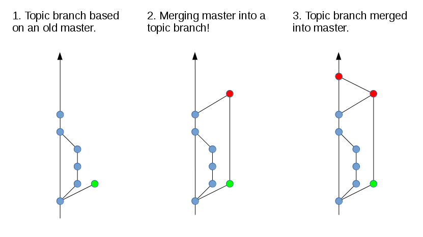
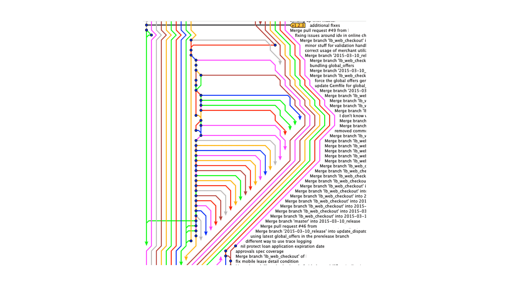
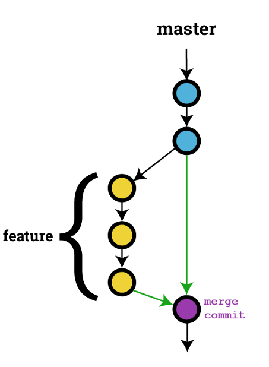
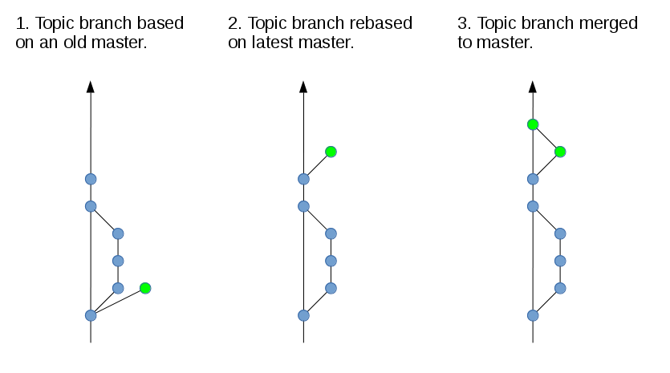
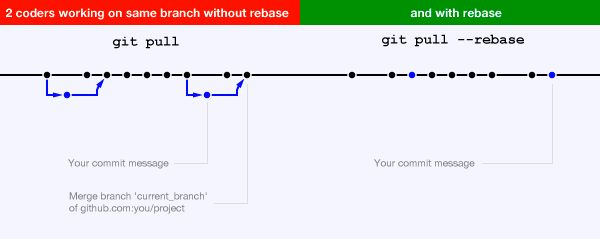

# Collaborer avec git
### Vive les rebase !

--

## C'est quoi le besoin ?
  
Collaborer simplement avec git, avec un minimum d'effort.

--

### Sommaire
  
1. C'est quoi git ?
2. C'est quoi un rebase ? Et pourquoi c'est mieux ?
3. Configurer git
4. Créer un repo
5. Faire un commit
6. Créer une pull request et merge
7. Faire ça à plusieurs mais bien
8. Quelques outils

---

# 1. C'est quoi git ?
  


--

Pour les ancêtres dans la sale, git c'est SVN mais en mieux.  
C'est un système de contrôle de version, le plus utilisé à ce jours,  
open source et développé à l'origine par [Linus Torvalds](https://fr.wikipedia.org/wiki/Linus_Torvalds).  
Il permet de versionner son code ou autres,  
mais aussi le partager de façon simple et efficace (quand on sait l'utiliser).

---

# 2. C'est quoi un rebase ? Et pourquoi c'est mieux ?
  


--

## Tout d'abord, c'est quoi le merge ?
  
Merge est un processus de fusion de deux branches.  
Tout comme le rebase, mais avec un traitement différent :
- Créer un commit de merge
- La branche qu'on merge est prioritaire sur la branche de destination
- Tout les merges sont gardé dans l'historique
- Pas de gestion de conflit étape par étape
- ...

--

Les merges ne devraient jamais être utilisés pour récupérer  
des modifications dans une branche de feature.



--

Sinon on va se retrouver avec ça et bon courage pour s'y retrouver.



--

Mais pour introduire des modifications dans la branche principale oui.  
Seulement si vous êtes à jours avec la branche de destination.



--

Exemple de merge :
  
```
git checkout master
git pull
git checkout feature
git merge master
git push
```

--


--

En conclusion, on ne peut pas se passer de merges.  
Mais seulement dans un seul sens, de la branche feature vers la develop.

--

## C'est quoi un rebase ?
  
Le rebase est comme je l'ai déjà dit, un processus de fusion de deux branches.  
Mais en moins violent :  
- Mise en tampon des modifications de la branche de destination
- Application des modifications la branche de source
- Application des modifications de la branche de destination commit par commit
- Meilleures gestions des conflits
- Pas de commit de merge superflus

--

Une illustration de ce que fait un rebase


--

Voici comment récupérer correctement les modifications de la branche mère de votre feature.



--

Exemple de rebase sans conflits :

```
git checkout master
git pull --rebase
git checkout feature
git rebase master
git push -f
```

--

## Les conflits
  
Avec le merge la question ne se pose pas, la branche source écrase tout ce quelle peut.  
Pour le reste, vous devez tout résoudre en même temps.  
  
Pour le rebase, c'est différent, cela ce fait par N étapes.  
N étant le nombre de commits de la branche de destination.  
Ce qui permet d'avoir le control sur les conflits de chaques commits.  
Cependant, attention vous devez résoudre que les conflits et rien de plus.  
Au risque de multiplier les conflits.  

--

Pour chaque commit en conflit, il faut résoudre le conflit, et ensuite appliquer les modifications.
  
```
git add .
git rebase --continue
```

--

## En cas de problème lors d'un rebase  
  
# Arrêtez tout ! Et recommencez !
  
```
git rebase --abort
```

--

### Qui suit réellement ?  
  
Avez-vous remarqué une différence dans les examples de merge/rebase ?  
Si oui laquel ?

--

## Git pull / git pull --rebase
  
- ``` git pull ``` => fait un merge  
- ``` git pull --rebase ``` => fait un rebase

--



--

## Attention les rebases réécrivent l'arbre !
  
C'est pourquoi il faut les manipuler avec précaution.  
Car un ``` git push -f ``` est irréversible.

--

## Squash ses commits pour n'avoir qu'une étape de rebase
  
Cela évite de passer trop de temps sur le rebase mais n'est pas toujours judicieux.  

Pour un ajout de feature cela à du sens, car toutes les modifications  
sont normalement nouvelles.  
  
Pour un refacto ou une correction, cela à moins de sens de sens.

--

- ``` git rebase -i <commit_sha> ```  
  le commit_sha est celui à partir du quel vous avez démarré votre branche
- Une page d'éditeur s'ouvre, remplacer les ``` pick ``` par la valeur que vous souhaitez
- Sauvegarder et fermer l'éditeur
- ``` git push -f ```

--

## Conclusion
  
- Récupérer les modifications de la branche source => rebase
- Fusionner les modifications de la branche feature dans la branche principale => merge
- Squash quand ça à du sens
- En cas de problème, arrêter le rebase et recommencer

---

# 3. Configurer Git

Depuis plusieurs années, j'utilise là même configuration pour Git.  
Qui fonctionne bien avec les rebases et les merges.  
Localisez votre ``` .gitconfig ``` dans votre dossier personnel, et collez-y ce que suit.

--

- Configuration du user

```
[user]
	name = Nolan Roose
	email = roose.nolan@gmail.com
```

--

- Configuration d'affichage

```
[color]
    ui = auto
[color "branch"]
    upstream = cyan
```

-- 

- Quelques alias utiles

```
[alias]
    poule = pull --rebase
    co = checkout
    ci = commit
    br = branch
    today = log --since=midnight --author='Nolan Roose' --oneline
    lg = log --graph --date=relative --pretty=tformat:'%Cred%h%Creset -%C(auto)%d%Creset %s %Cgreen(%an %ad)%Creset'
    oops = commit --amend --no-edit
```

--

- Configuration du push

```
[push]
    # Default push should only push the current branch to its push target, regardless of its remote name
    default = current
    # When pushing, also push tags whose commit-ishs are now reachable upstream
    followTags = true
```

--

- Configuration du diff

```
[diff]
    # Use better, descriptive initials (c, i, w) instead of a/b.
    mnemonicPrefix = true
    # Show renames/moves as such
    renames = true
    # When using --word-diff, assume --word-diff-regex=.
    wordRegex = .
    # Display submodule-related information (commit listings)
    submodule = log
```

--

- Configuration des logs

```
[log]
    # Use abbrev SHAs whenever possible/relevant instead of full 40 chars
    abbrevCommit = true
    # Automatically --follow when given a single path
    follow = true
```

---

# 4. Créer un repo

- Créer un repo sur Github/Gitlab/Bitbucket ...

```
git init
git checkout -b master
git add README.md
git commit -m "first commit"
git remote add origin git@github.com:NolanRoose-presentation/practice.git
git push -u origin master
```

---

# 5. Faire un commit

Après avoir créé le repo, et fait ses premières modifications, on peut commit.

```
git add .
git commit -m "first commit"
git push
```

---

# 6. Créer une pull request et merge

## Créer une branche

``` 
git checkout -b feature
git push -u origin feature
```

--

## Faire vos modifications et commit

c.f 5. Faire un commit

--

## Se mettre à jour avec la branche master

- Squash si necessaire
- Rebase la branche master

--

## Pull request time

- Review de la pull request
- Merge de la pull request

---

# 7. Faire ça à plusieurs mais bien

## Il est l'heure de s'amuser un peu ! A vos claviers !

---

# Quelques outils

- [Git extras](https://github.com/tj/git-extras), plein de commandes utiles
- [Ungit](https://www.npmjs.com/package/ungit), un joli arbre
